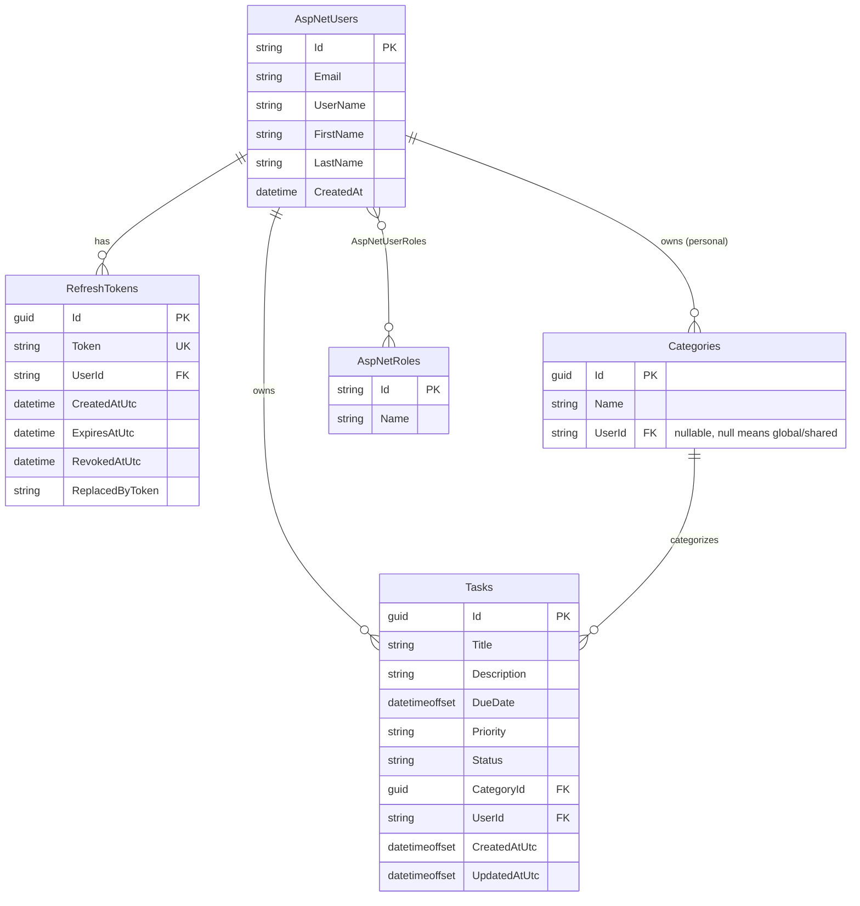

# CBRE Assessment Task List Demo

A task management app with an Angular frontend and an ASP.NET Core Web API backend, with PostgreSQL as the database provider. This has basic task CRUD functionality and supports both traditional email/password as well as Google Sign-In authentications.

## Table of Contents

- [Tech Stack](#tech-stack)
- [Setup Guide](#setup-guide)
  - [Prerequisites](#prerequisites)
  - [1. Database](#1-database)
  - [2. Backend](#2-backend)
  - [3. Frontend](#3-frontend)
  - [4. Google Sign-In Configuration](#4-google-sign-in-configuration)
- [Authentication](#authentication)
  - [Why ASP.NET Core Identity](#why-aspnet-core-identity)
  - [Why Google SSO](#why-google-sso)
  - [Token Flow](#token-flow)
- [Database Schema Overview](#database-schema-overview)

## Tech Stack

| Layer | Technology |
|---|---|
| Frontend | Angular 21, TypeScript |
| Backend | ASP.NET Core Web API (.NET 10) |
| Auth | ASP.NET Core Identity, JWT bearer tokens, Google Identity Services (OAuth/OIDC) |
| Database | PostgreSQL (via Entity Framework Core / Npgsql) |
| API Docs | OpenAPI + Scalar (development only) |

## Setup Guide

### Prerequisites

- [.NET 10 SDK](https://dotnet.microsoft.com/download)
- [Node.js 20+](https://nodejs.org/) and npm
- [PostgreSQL](https://www.postgresql.org/download/) running locally (or in a container)
- `dotnet-ef` CLI tool: `dotnet tool install --global dotnet-ef`

### 1. Database

Create a local Postgres database (defaults below match `backend/appsettings.json`):

```
Host: localhost
Port: 5432
Database: tasklist_db
Username: postgres
Password: postgres
```

Adjust `ConnectionStrings:DefaultConnection` in `backend/appsettings.json` (or better, override it via [user secrets](https://learn.microsoft.com/aspnet/core/security/app-secrets) / environment variables) if your local setup differs.

### 2. Backend

From the `backend/` directory:

```bash
# Restore dependencies
dotnet restore

# Apply EF Core migrations to create the schema
dotnet ef database update

# Run the API
dotnet run
```

The API starts at `http://localhost:5232` (and `https://localhost:7006` for the `https` launch profile). On first run it seeds the `Admin` and `User` roles automatically.

In development, an interactive API reference is available at `/scalar` (using the generated OpenAPI document at `/openapi/v1.json`).

User secrets have been initialized for local development. Values for the jwt token key and database connection are stored in the .NET user secret feature.

```bash
# Initialize Secrets
dotnet user-secrets init

# Add Secrets
dotnet user-secrets set "Jwt:Key" "<Generate a secret>"
dotnet user-secrets set "ConnectionStrings:DefaultConnection" "Host=localhost;Port=;Database=tasklist_db;Username=<YOUR_USER>;Password=<YOUR_PWD>"

```

### 3. Frontend

From the `frontend/` directory:

```bash
# Install dependencies
npm install

# Start the dev server
npm start
```

The app is served at `http://localhost:4200`. API calls to `/api` are proxied to the backend (`https://localhost:7006`) via `proxy.conf.json`, so make sure the backend is already running first.

### 4. Google Sign-In Configuration

Google Sign-In requires an OAuth 2.0 Client ID from the [Google Cloud Console](https://console.cloud.google.com/apis/credentials):

1. Create an OAuth 2.0 Client ID of type **Web application**.
2. Add `http://localhost:4200` as an authorized JavaScript origin.
3. Set the client ID in **both** places, since the frontend requests the ID token and the backend independently verifies it:
   - `frontend/src/environments/environment.ts` → `googleClientId`
   - `backend/appsettings.json` → `Google:ClientId` or defer it to user-secrets mentioned in the setup

These two values must match, or the backend will reject the Google ID token during audience validation.

Alternatively, we can probably utilize the ClientID I've generated for testing this out.

## Authentication

My choices are really limited to what I'm familiar with and have used in my experience; those are a custom auth, .ASPNET's Identity package and Microsoft Identity Platform (EntraID). AspNet Identity seems to be the sensible choice for what it can do out of the box.

The app supports two sign-in paths, email/password and Google SSO, but both end up producing the same app-issued JWT. That way the rest of the API only ever has to understand one auth scheme.

### ASP.NET Core Identity

Password-based auth is handled by ASP.NET Core Identity (`UserManager<ApplicationUser>`) rather than a hand-rolled solution:

- Password hashing, salting, and validation are security-critical and easy to get subtly wrong. Identity's implementation is well-reviewed and battle-tested, so there's no reason to reinvent it.
- It integrates directly with EF Core (`ApplicationDbContext` extends `IdentityDbContext<ApplicationUser, IdentityRole, string>`), so user, role, and login-provider storage come for free with a sensible schema and indexing already in place.
- Role management comes built in too. It isn't heavily used yet, but `Admin` and `User` roles are already seeded on startup, with `User` as the default for new accounts.
- Already supports external login integrations.

### Token Flow

1. **Access token.** A short-lived (default 60 minutes) JWT signed with a symmetric key (HMAC-SHA256), returned in the response body and sent by the client as an `Authorization: Bearer <token>` header on every API call.
2. **Refresh token.** A long-lived (default 14 days), opaque random value, persisted server-side in the `RefreshTokens` table and delivered to the client as an `HttpOnly`, `Secure`, `SameSite=Strict` cookie scoped to `/api/auth`. It's never exposed to client-side JavaScript.
3. **Refresh and rotation.** `POST /api/auth/refresh` exchanges a valid refresh token cookie for a new access token and a new refresh token, immediately revoking the one just used (`ReplacedByToken`). This limits the damage if a refresh token is ever leaked or replayed.
4. **Logout.** `POST /api/auth/logout` revokes the current refresh token server-side and clears the cookie, so a stolen token can't be reused after logout even if it hasn't expired yet.

## Database Schema Overview



**Notes on the schema:**

- All `AspNet_` tables come from ASP.NET Core Identity's default schema. `AspNetUsers` is extended here with `FirstName`, `LastName`, and `CreatedAt`.
- `Categories.UserId` is nullable. `NULL` marks a global category visible to every user, while a set value marks a personal category owned by that user. A unique index on `(UserId, Name)` stops duplicate names per user (and among global categories), relying on Postgres treating `NULL` as distinct per row.
- `Tasks.Priority` and `Tasks.Status` are stored as strings (via EF Core value conversion) rather than integers, so the underlying enum values stay human-readable in the database and can be reordered in code without needing a data migration.
- Deleting a user cascades to their `RefreshTokens`, `Tasks`, and `Categories`. Deleting a category that a task points to just sets that task's `CategoryId` to `NULL` instead of deleting the task.
